<p align="center">
  
</p>

# KeyForge

A tiny desktop app that turns any text into human-like keystroke timings using a trained DeBERTa heteroscedastic regression model, then either exports the per-character timings as a CSV or actually types the text into whatever window you focus.

This folder is self-contained — you can grab just `KeyForge/` if you only want the tool.

## Features

- **Generate** — predicts per-character `DwellTime` and `FlightTime` from your input text.
- **Download CSV** — saves the raw prediction to `KeyForge/output/`.
- **TypeIt** — replays the keystrokes via `pynput` into whatever window has focus, with a 3-second countdown so you can click into your target.
- **Typing-speed slider** — rescales replay timing between 20–120 WPM (default ≈40 WPM, the average typist). Only affects replay; the CSV is always the raw model output.

## Install

```powershell
pip install -r requirements.txt
```

For GPU, install torch first from <https://pytorch.org/get-started/locally/> before running the command above.

## Required files

Place these in `KeyForge/Model/`:

- `best_model.pt` — trained checkpoint
- `cont_stats.json` — standardization stats (mean/std) from training

Both are produced by the training pipeline in the parent repo.

## Run

```powershell
python app.py
```

## Project layout

```
KeyForge/
├── app.py                   # Tkinter UI
├── requirements.txt
├── assets/                  # themed SVG headers
├── Model/
│   ├── best_model.pt
│   └── cont_stats.json
├── output/                  # CSVs land here
└── Synthesize/
    ├── synthesize.py        # predict_keystrokes(text) -> DataFrame
    └── TextToKeystrokeModelMultiHead.py
```

## How the slider works

The model's predictions correspond roughly to an average typist (~40 WPM). Each replay delay is multiplied by `40 / target_wpm`, so:

- Slider at 40 → replay as predicted.
- Slider at 80 → half the delays (2× faster).
- Slider at 20 → double the delays (2× slower).

## Notes

- Replay is OS-level keyboard injection. The target window must have focus during replay — the countdown exists for exactly this reason.
- Non-ASCII characters fall back to `keyboard.type(ch)` which may be slower or less reliable depending on OS keyboard layout.